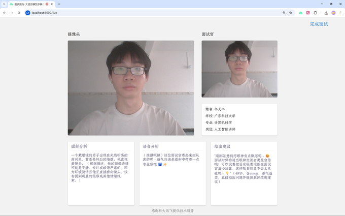
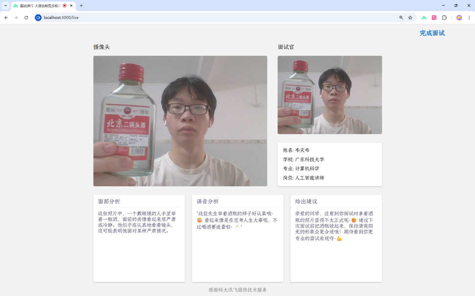
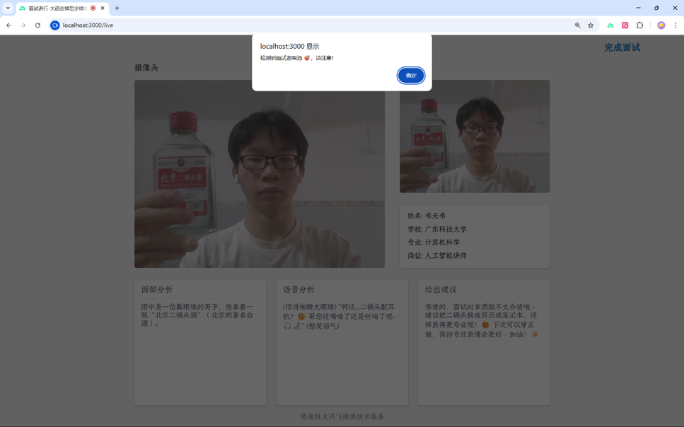

# 效果展示





# 如何使用
## 第一步 填写科大讯飞 Api-key
```
在 /public/live.vue 文件中填写 apiKey
感谢科大讯飞星火大模型(Spark pro)提供问答服务
```
## 第二步 启动Llama
```
llama-server -hf ggml-org/InternVL3-2B-Instruct-GGUF
```
## 第三步 启动nuxt 然后进入localhost:3000/live
```
npm i  
npm run dev
```


